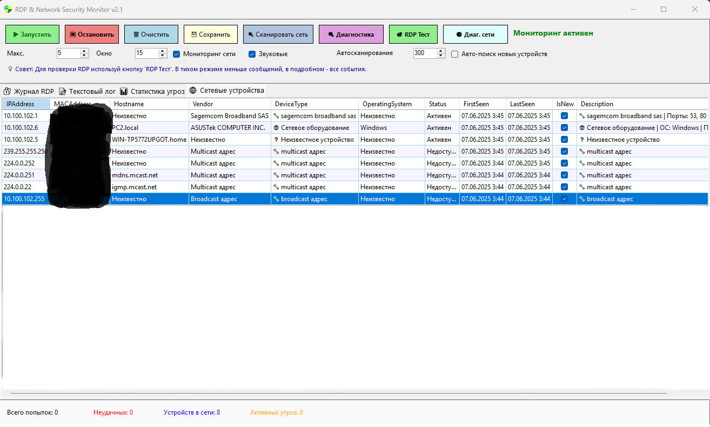

# RDP & Network Security Monitor v2.1

<p align="center">
  
  
  
  
</p>

<p align="center">
  
</p>

## 🔐 Описание

**RDP & Network Security Monitor** - это комплексная система мониторинга безопасности для Windows, которая отслеживает попытки RDP-подключений и сканирует локальную сеть на наличие новых устройств.

### 🌟 Основные возможности

- **Мониторинг RDP событий** в реальном времени
- **Обнаружение подозрительной активности** (множественные неудачные попытки входа)
- **Сканирование локальной сети** и обнаружение новых устройств
- **Определение производителей** по MAC-адресам (база 30,000+ записей)
- **Оценка рисков** для каждого устройства в сети
- **Уведомления** о критических событиях безопасности
- **Экспорт логов** в CSV формат

## 📋 Системные требования

- Windows 10/11 или Windows Server 2016+
- .NET Framework 4.7.2 или выше
- Права администратора (для полного функционала)
- 50 MB свободного места на диске

## 🚀 Быстрый старт

### Установка

1. Скачайте последний релиз из раздела [Releases](../../releases)
2. Распакуйте архив в любую папку
3. Убедитесь, что файл `MAC.db` находится в той же папке, что и `RDPLoginMonitor.exe`
4. Запустите `RDPLoginMonitor.exe` от имени администратора

### Первый запуск

1. При запуске программа проверит наличие прав администратора
2. Нажмите кнопку **"▶ Запустить"** для начала мониторинга
3. Используйте **"🔍 Сканировать сеть"** для поиска устройств в локальной сети
4. Проверьте работу через **"🎯 RDP Тест"** или **"🌐 Диаг. сети"**

## 🎛️ Интерфейс программы

### 📸 Скриншоты

<details>
<summary>Нажмите для просмотра скриншотов</summary>

#### Главное окно


</details>

### Основные вкладки

- **🔐 Журнал RDP** - отображение всех RDP событий
- **📝 Текстовый лог** - подробные логи работы программы
- **📊 Статистика угроз** - анализ подозрительной активности
- **🌐 Сетевые устройства** - список всех найденных устройств

### Панель управления

| Кнопка | Описание | Требует админ права |
|:------:|:---------|:-------------------:|
| **▶ Запустить** | Запуск мониторинга | ✅ |
| **⏹ Остановить** | Остановка мониторинга | ❌ |
| **🗑 Очистить** | Очистка всех логов | ❌ |
| **💾 Сохранить** | Экспорт данных в CSV | ❌ |
| **🔍 Сканировать сеть** | Поиск устройств в сети | ❌ |
| **🔍 Диагностика** | Проверка RDP функций | ✅ |
| **🎯 RDP Тест** | Тестирование RDP мониторинга | ✅ |
| **🌐 Диаг. сети** | Проверка сетевых функций | ❌ |

## 🔧 Настройки

- **Макс. попыток** - количество неудачных попыток до срабатывания тревоги (по умолчанию: 5)
- **Окно времени** - период отслеживания попыток в минутах (по умолчанию: 15)
- **Мониторинг сети** - включить/выключить сканирование сети
- **Звуковые уведомления** - звуковые сигналы при обнаружении угроз
- **Автосканирование** - периодическое сканирование сети (интервал в секундах)

## 📊 Отслеживаемые события

### RDP События
- **4624** - Успешный вход в систему
- **4625** - Неудачная попытка входа
- **4634** - Завершение сеанса
- **4647** - Выход пользователя
- **4778** - RDP переподключение
- **4779** - RDP отключение

### Типы входа (Logon Types)
- **2** - Интерактивный (консоль)
- **3** - Сетевой (SMB, общие папки)
- **7** - Разблокировка экрана
- **10** - RDP/Terminal Services
- **11** - Кэшированный интерактивный

## 🌐 Сетевой мониторинг

### Определение устройств
Программа автоматически определяет:
- Производителя по MAC-адресу
- Тип устройства (компьютер, телефон, роутер и т.д.)
- Операционную систему
- Открытые порты
- Уровень риска

### Уровни риска
- 🟢 **БЕЗОПАСНО** - обычные устройства без открытых критичных портов
- 🟢 **НИЗКИЙ РИСК** - устройства с минимальными сетевыми сервисами
- 🟡 **СРЕДНИЙ РИСК** - устройства с открытыми портами управления
- 🔴 **ВЫСОКИЙ РИСК** - устройства с RDP, SSH или неизвестные устройства

## 🛠️ Решение проблем

### Программа не видит RDP события
1. Убедитесь, что запущена от имени администратора
2. Проверьте что включен аудит входов:
   ```
   gpedit.msc → Computer Configuration → Windows Settings → 
   Security Settings → Local Policies → Audit Policy → 
   Audit logon events → Success & Failure
   ```
3. Используйте кнопку "RDP Тест" для диагностики

### Не определяются производители устройств
1. Проверьте наличие файла `MAC.db` в папке с программой
2. Используйте "Диаг. сети" для проверки базы данных
3. Обновите базу MAC-адресов (см. раздел ниже)

### Программа зависает при запуске
1. Отключите антивирус временно
2. Запустите в режиме совместимости с Windows 8
3. Проверьте размер журнала Security (не должен превышать 1GB)

## 📦 Обновление базы MAC-адресов

1. Скачайте свежую базу с [IEEE OUI](https://standards-oui.ieee.org/oui/oui.txt)
2. Используйте конвертер из папки `Tools/OUIConverter.exe`:
   ```cmd
   OUIConverter.exe oui.txt MAC.db
   ```
3. Замените старый файл `MAC.db` новым

## 🔒 Безопасность

- Программа **не передает** данные в интернет
- Все логи хранятся **локально**
- Пароли и учетные данные **не сохраняются**
- Используются только **стандартные Windows API**

## 📝 Лицензия

Этот проект распространяется под лицензией MIT. См. файл [LICENSE](LICENSE) для подробностей.

## 🤝 Вклад в проект

Мы приветствуем любой вклад в развитие проекта!

1. Fork репозитория
2. Создайте ветку для новой функции (`git checkout -b feature/AmazingFeature`)
3. Commit изменения (`git commit -m 'Add some AmazingFeature'`)
4. Push в ветку (`git push origin feature/AmazingFeature`)
5. Откройте Pull Request

## 📧 Контакты

- **Issues**: [GitHub Issues](../../issues)
- **Discussions**: [GitHub Discussions](../../discussions)

## 🙏 Благодарности

- IEEE за открытую базу OUI MAC-адресов
- Microsoft за документацию Windows Event Log API
- Сообществу .NET разработчиков за примеры и советы

---

<p align="center">Made with ❤️ for Windows Security</p>